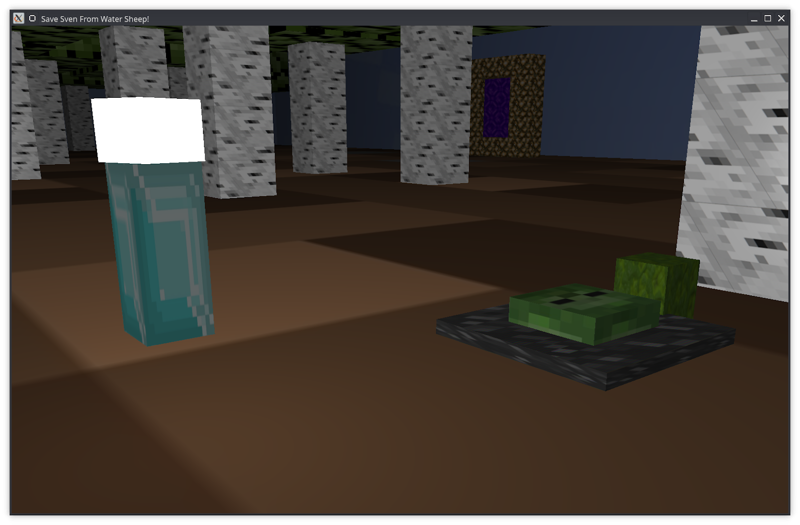
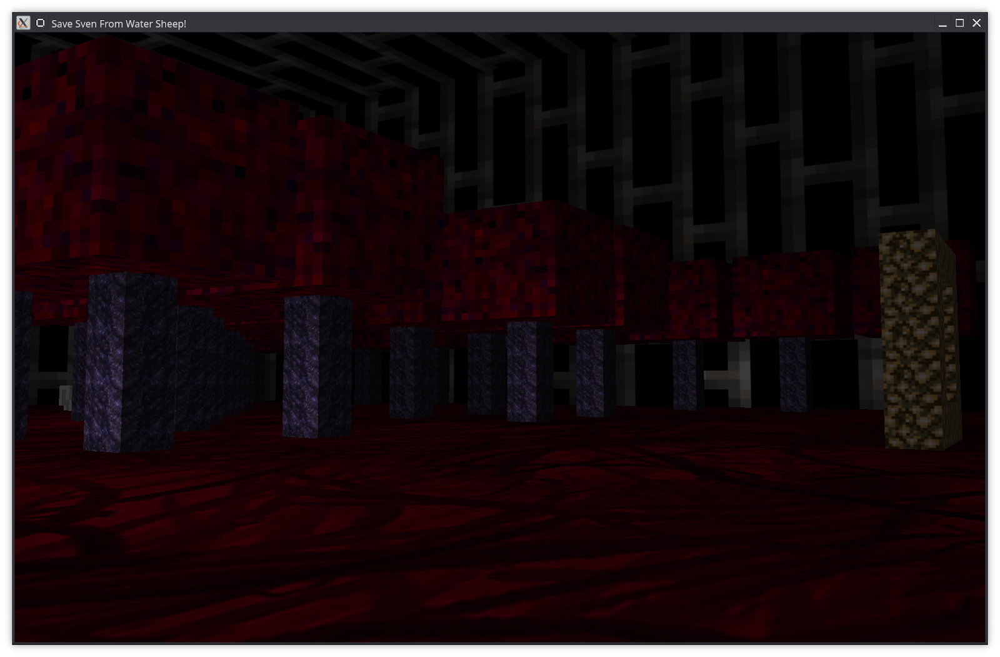

# OpenGL Game Demo

### Dependencies

1. `sudo apt-get update` update package lists
2. `sudo apt install cmake`  install cmake
3. `sudo apt-get install -y build-essential` install necessary g++ compilers
4. `sudo apt-get install cmake xorg-dev libglu1-mesa-dev` install GLFW dependencies
5. Install GLFW:
1. Download GLFW from [here](http://sourceforge.net/projects/glfw/files/glfw/3.0.4/glfw-3.0.4.zip/download)
   2. Unzip the downloaded file
3. `cd glfw-3.0.4` go into the unzipped file
   4. `cmake -G "Unix Makefiles"`
   5. `make`
   6. `sudo make install` install GLFW on the machine
6. `sudo apt-get install libassimp-dev assimp-utils` install libassimp

### Running the program

1. Make sure you have the required libraries installed ([Dependencies](#Dependencies))
2. Navigate to the "OpenGL/build/" directory. This directory should be empty (If build doesn't exist, create it)
3. In the terminal, run the following command: "cmake .."
4. In the terminal, run the following command: "make"
5. Navigate to the "OpenGL/build/bin/3.openGL_tutorial/" directory
6. In the terminal, run the following command: "./3.openGL_tutorial__sample_2"
7. The program should now be running

### Viewing the source code

All source code is located in the "OpenGL/src/3.openGL_tutorial/sample_2/" directory:
-  "Source.cpp" - Contains the bulk of the program code. This is where the program runs from.
-  "Camera.h" - A file defining the Camera class, used in "Source.cpp" to define the Camera object
-  "Shader.h" - A file defining the Shader class, used in "Source.cpp" to define the lampShader and lightingShader objects
-  "lightingFS.fs" and "lightingVS.vs" - Files defining the world's vertex and fragment shaders
-  "lampFS.fs" and "lampVS.vs" - Files defining the light source's vertex and fragment shaders
-  "stb_image.h" - Defines the stb_image library, used in "Source.cpp" to load in textures

### Screenshots

